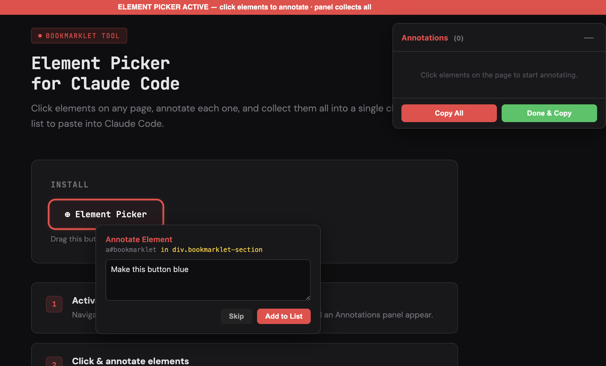
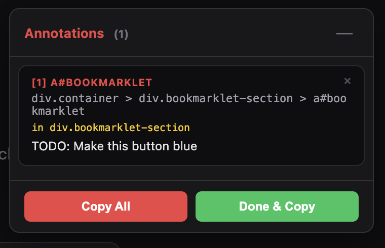

# Element Picker for Claude Code

A bookmarklet that lets you click elements on any web page, annotate what needs to change, and copy a structured list to paste directly into [Claude Code](https://docs.anthropic.com/en/docs/claude-code).

  

## Why

When working with Claude Code on a frontend project, describing *which* element you want changed and *where* it lives in the DOM is tedious. This bookmarklet lets you point and click instead — select elements visually, type what you want changed, and get a clipboard-ready annotation list that gives Claude Code the selector, full CSS path, container context, and your instructions.




## Demo

```
[1] button#submit-btn.btn-primary
Path: div.container > form#checkout > div.actions > button#submit-btn.btn-primary
In: div.actions
Text: "Submit Order"
TODO: Make this green with white text

[2] h1.page-title
Path: div.container > header.top-bar > h1.page-title
In: header.top-bar
Text: "Dashboard"
TODO: Change to "Overview" and reduce font size
```

## Install

1. Open `element-picker.html` in your browser
2. Drag the **⊕ Element Picker** button to your bookmarks bar

That's it. No build step, no npm, no extensions.

## Usage

1. **Navigate** to any page you're working on
2. **Click the bookmarklet** in your bookmarks bar — a red banner and Annotations panel appear
3. **Hover** over elements — they highlight with a red dashed outline
4. **Click** an element — it locks with a solid red outline and a comment dialog appears
5. **Type your comment** describing what needs to change, then press `Enter` or click **Add to List**
6. **Repeat** for as many elements as you want — each annotation is added to the panel
7. **Review** your list in the panel — remove any with the × button
8. **Click Done & Copy** (or press `Esc`) to copy all annotations to your clipboard and exit
9. **Paste** into Claude Code

## Output Format

Each annotation includes:

| Field | Description |
|-------|-------------|
| `[n] selector` | Element tag, ID, and classes |
| `Path` | Full CSS selector path from root — lets Claude Code locate the element unambiguously |
| `In` | Nearest container element (div, section, nav, form, etc.) — only shown for non-container elements |
| `Text` | Visible text content (truncated to 60 chars) |
| `TODO` | Your annotation describing what to change |

## Features

- **Batch annotations** — collect multiple element annotations in a single session
- **Persistent panel** — floating panel tracks all your annotations with a running count
- **Full CSS path** — walks the entire DOM tree to build a unique selector path
- **Container detection** — automatically finds the nearest enclosing container (div, section, article, nav, form, header, footer, etc.) with role/aria-label attributes when present
- **Minimizable panel** — collapse the panel with the — button when it covers content you need to click
- **Remove individual items** — delete any annotation from the list before copying
- **Copy All** — copy to clipboard without exiting the picker (to keep annotating)
- **Done & Copy** — copy everything and clean up in one click
- **Esc to exit** — copies all annotations and exits automatically
- **`<br>` handling** — replaces `<br>` tags with spaces in captured text so output reads naturally
- **Zero dependencies** — single HTML file, no libraries, no build tools
- **Works on any page** — all processing happens locally in the browser

## Keyboard Shortcuts

| Key | Context | Action |
|-----|---------|--------|
| `Enter` | Comment dialog | Save annotation and add to list |
| `Esc` | Comment dialog | Cancel / skip this element |
| `Esc` | Picker active (no dialog open) | Copy all annotations and exit |

## Browser Support

Tested in Chrome, Firefox, Safari, and Edge. Requires `navigator.clipboard.writeText` (available in all modern browsers over HTTPS or localhost/file).

## How It Works

The bookmarklet injects a small set of styles and event listeners into the current page. It uses `mousemove` and `click` handlers in the capture phase to intercept element interactions without interfering with the page's own event handlers. All injected elements use a `__ep-` class prefix to avoid style collisions. On exit, everything is cleaned up — styles, event listeners, panel, and element highlights are all removed.

## License

MIT
